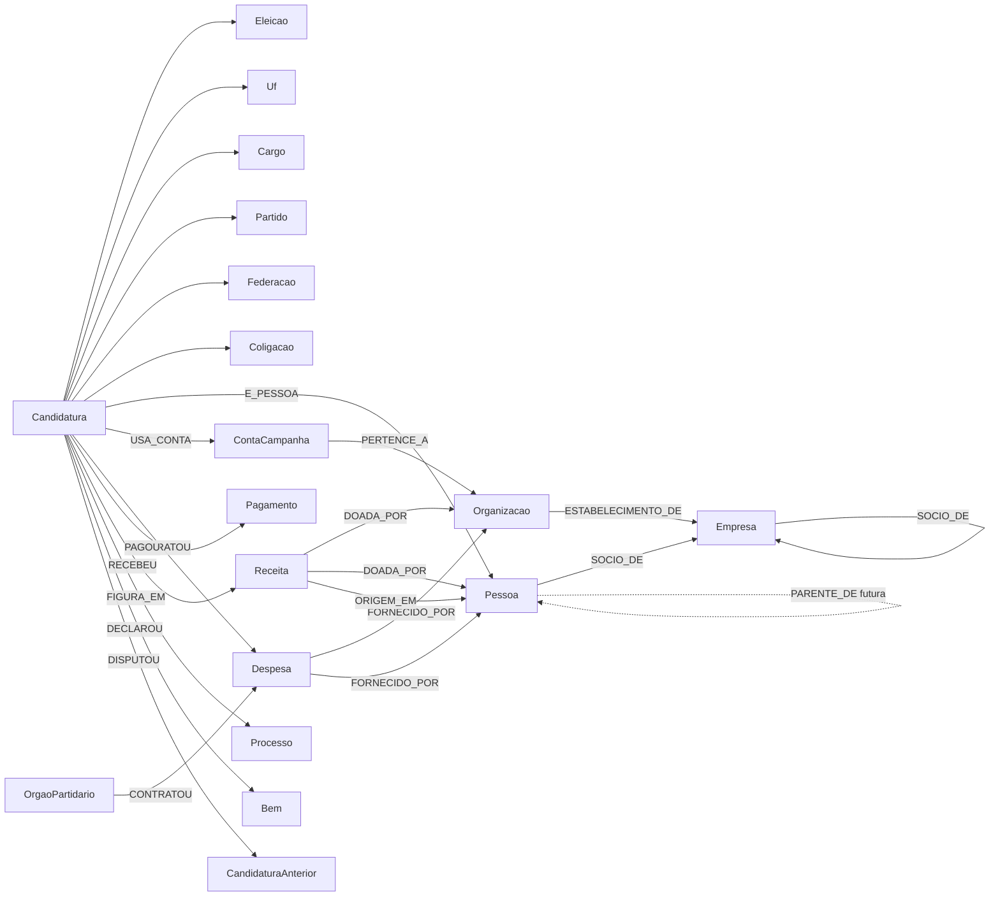

# Modelo do grafo - Sou Fiscal

Contrato do Neo4j usado pela ficha de candidato. Uma importação nova (Receita Federal, JUCESP, tabela de preços, outro ano do TSE) entra neste modelo sem criar um jeito paralelo de ligar as mesmas coisas.

O grafo guarda a estrutura pública da campanha. Ele não guarda CPF, título de eleitor, e-mail nem o identificador individual de eleitor (`SQ_ELEITOR`).

## Identidade

| Coisa | Chave | Onde fica |
| --- | --- | --- |
| Candidatura | `Candidatura.sq` = `SQ_CANDIDATO` do TSE | nó `:Candidatura` |
| Pessoa física | `Pessoa.chave` = `cpf:` + SHA-256 hex do CPF, só dígitos, com zeros à esquerda até 11 | nó `:Pessoa` |
| Empresa ou CNPJ de campanha | `Organizacao.cnpj` = 14 dígitos, com zeros à esquerda, e CNPJ válido | nó `:Organizacao` |
| Partido | `Partido.numero` | nó `:Partido` |
| Despesa, receita, bem, pagamento | id SHA-256 dos campos que distinguem a linha | propriedade `id` |

O hash do CPF está em `import/src/lib/documento.js` (`classificarDocumento` e `hashDocumento`). Qualquer fonte futura tem de usar a mesma função: só dígitos, sem máscara, SHA-256 em hexadecimal. Sem sal. O hash não volta na API. Ele existe para a Receita Federal e a JUCESP apontarem para a mesma `:Pessoa` que o TSE.

CPF com dígito verificador inválido não vira `:Pessoa`. Nesse caso o fornecedor fica em `:AgenteNaoIdentificado`, sem fusão com outras linhas.

CNPJ de campanha também é `:Organizacao` e `:ContaCampanha`. Os dois usam os 14 dígitos.

## Nós

### Já carregados pelo TSE

| Rótulo | Propriedades principais | Origem |
| --- | --- | --- |
| `Eleicao` | `id` (`ano-turno-codigo`), `ano`, `turno`, `descricao`, `data`, `tipo` | `consulta_cand` |
| `Uf` | `sigla` | vários |
| `Cargo` | `codigo`, `nome` | `consulta_cand` |
| `Partido` | `numero`, `sigla`, `nome` | `consulta_cand` |
| `Federacao` | `numero`, `sigla`, `nome`, `composicao` | `consulta_cand` |
| `Coligacao` | `id` (`UF:SQ_COLIGACAO`), `nome`, `composicao`, `situacao`, `uf` | `consulta_cand` e `consulta_coligacao` |
| `Candidatura` | `sq`, `numero`, `nome`, `nomeUrna`, `nomeSocial`, `nomeBusca`, `uf`, `genero`, `corRaca`, `grauInstrucao`, `ocupacao`, `situacaoJulgamento`, `situacaoUrna`, `despesaMax`, `nrProcesso`, `geradoEm`, `arquivoFoto`, `arquivoProposta` | `consulta_cand` + complementar |
| `Pessoa` | `chave`, `documentoHash`, `documentoTipo` (`CPF`), `nome`, `fonte` | candidato, fornecedor PF, doador PF |
| `Organizacao` | `cnpj`, `nome`, `nomeRfb`, `nomeReceita`, `cnae`, `cnaePrincipal`, `naturezaJuridica`, `tipoPrestador` (`candidato` ou `partido`), `fonte` | fornecedor, doador, arquivo de CNPJ |
| `ContaCampanha` | `cnpj`, `tipoPrestador` | prestação de contas e `CNPJ_campanha` |
| `Despesa` | `id`, `sqTse`, `valor`, `data` (ISO), `origem`, `grupo`, `descricao`, `tipoPrestacao`, `prestador` (`candidato` ou `orgao`), `fornecedorChave` | despesas contratadas |
| `Pagamento` | `id`, `sqDespesa`, `valor`, `data`, `fonteRecurso`, `especie` | despesas pagas |
| `Receita` | `id`, `sqTse`, `valor`, `data`, `origem`, `fonteRecurso`, `natureza`, `especie`, `doadorChave` | receitas |
| `Bem` | `id`, `tipo`, `descricao`, `valor` | `bem_candidato` |
| `RedeSocial` | `url` | `rede_social_candidato` |
| `CandidaturaAnterior` | `id`, `ano`, `cargo`, `partido`, `uf`, `resultado` | `historico_candidatura` |
| `Motivo` | `id`, `tipo`, `descricao`, `processo` | `motivo_cassacao` |
| `Processo` | `numero`, `classe`, `assunto`, `uf`, `url`, `relator` | `processo_eleitoral` + partes |
| `Vaga` | `id` (`UF:codigo do cargo`), `quantidade` | `consulta_vagas` |
| `OrgaoPartidario` | `id`, `esfera`, `uf`, `municipio` | despesas de órgãos |
| `AgenteNaoIdentificado` | `id`, `nome` | fornecedor sem CPF/CNPJ válido |
| `Comprovante` | `url` | arquivos de documento |
| `Carga` | `id` = `tse-2026`, `importadoEm`, `uf` | fim da importação |

`Despesa.grupo` resume a origem: `impressos`, `impulsionamento`, `militancia`, `pessoal`, `veiculos`, `combustivel`, `publicidade`, `outros`. A regra está em `import/src/lib/texto.js`.

`arquivoFoto` e `arquivoProposta` são o caminho convencional dentro do zip do TSE (`F{UF}{sq}_div.jpg` e `2026{UF}{sq}_01.pdf`). A importação não confere se o arquivo existe. Certidão criminal não entra no grafo: o PDF é imagem e o nome traz protocolo, não uma tabela.

### Reservados para a próxima fonte

Não são criados agora. O nome já fica combinado para não inventar outro na hora da Receita ou da JUCESP.

| Rótulo ou relacionamento | Uso |
| --- | --- |
| `(:Pessoa)-[:SOCIO_DE {qualificacao, fonte, desde, ate}]->(:Organizacao)` | Quadro de sócios da Receita Federal ou ficha da JUCESP |
| `(:Pessoa)-[:PARENTE_DE {grau, fonte}]->(:Pessoa)` | Parentesco vindo de base específica, nunca inferido pelo sobrenome |
| `(:Organizacao)-[:NO_ENDERECO]->(:Endereco {fonte, logradouro, municipio, uf, cep})` | Endereço de CNPJ para achar empresas no mesmo lugar |
| `(:ReferenciaPreco {id, fonte, grupo, uf, unidade, valor, vigencia})` | Preço de mercado de santinho, impressão ou impulsionamento |

`fonte` em relacionamento e nó diz de onde veio o fato: `tse:...`, `receita-federal`, `jucesp`.

## Relacionamentos carregados



Sentido que importa na leitura:

- `CONTRATOU` sai de quem prestou conta (candidatura ou órgão) e chega na despesa.
- `FORNECIDO_POR` sai da despesa e chega em quem recebeu.
- `DOADA_POR` sai da receita e chega no doador imediato.
- `ORIGEM_EM` sai da receita e chega no doador originário, quando o TSE separa os dois.
- `E_PESSOA` liga a candidatura à pessoa física do hash. É por aqui que um fornecedor é o candidato.
- `SUBSTITUIDO_POR` segue `SQ_SUBSTITUIDO` do arquivo complementar, no sentido em que o TSE gravou o campo.
- `FIGURA_EM` traz `polo` e `tipoParte`.
- `INTEGRA` liga partido à coligação.

O arquivo `*_BRASIL.csv` não é importado. Ele repete os arquivos por UF. `BR` é a eleição presidencial e entra quando a UF pedida é `all`.

## Como encaixar a Receita Federal

O snapshot mensal é o cadastro inteiro do país. A importação usa o zip mais recente de `arquivos-receita/` e só materializa CNPJ que já é `:Organizacao` no grafo. O catálogo dos arquivos está em `docs/arquivos-receita.md`.

A empresa (raiz de 8 dígitos) é `:Empresa {cnpjBasico}`. O estabelecimento de 14 dígitos continua em `:Organizacao` e aponta para a empresa com `ESTABELECIMENTO_DE`.

O CPF de sócio pessoa física nesse arquivo aberto vem mascarado. Não dá para calcular o mesmo SHA-256 do candidato, e os dígitos mascarados não são gravados. A pessoa do quadro societário entra com chave `qsa:{cnpjBasico}:{nome}` e `documentoTipo = 'CPF_MASCARADO'`. Sócio pessoa jurídica é outra `:Empresa`, ligada por `SOCIO_DE` no sentido de quem participa para a empresa participada.

```cypher
MERGE (e:Empresa {cnpjBasico: row.cnpjBasico})
SET e.razaoSocial = row.razaoSocial, e.fonte = 'receita-federal', e.referencia = row.referencia
MERGE (o:Organizacao {cnpj: row.cnpj})
MERGE (o)-[:ESTABELECIMENTO_DE]->(e)
MERGE (p:Pessoa {chave: row.chave})
MERGE (p)-[s:SOCIO_DE]->(e)
SET s.qualificacao = row.qualificacao, s.fonte = 'receita-federal', s.desde = row.desde
```

`PARENTE_DE` continua sem fonte. Enquanto isso, a ficha compara sobrenome incomum do candidato com o nome do sócio e com o fornecedor pessoa física. As duas regras estão em `back/src/alertas.js` e não provam parentesco.

## Como encaixar a JUCESP

A ficha cadastral paulista repete o mesmo padrão de sócio. Use `s.fonte = 'jucesp'` no mesmo relacionamento `SOCIO_DE`. Se a junta trouxer endereço, ligue a organização a um `:Endereco` em vez de gravar logradouro solto em cada despesa.

Empresas de outros estados seguem o mesmo nó `:Organizacao`. A UF não faz parte da chave do CNPJ.

## Preço de mercado

O TSE não traz quantidade de santinhos nem tabela de preço. O sinal atual (`impressos_acima_do_padrao`) compara a soma da candidatura com um fornecedor, no grupo `impressos`, com os outros pares candidatura-fornecedor da mesma UF. O corte é o maior entre o percentil 90, três vezes a mediana e R$ 8 mil, e só aparece se houver pelo menos 8 pares na UF.

Quando houver uma tabela externa:

```cypher
MERGE (r:ReferenciaPreco {id: row.id})
SET r.fonte = row.fonte, r.grupo = 'impressos', r.uf = row.uf,
    r.unidade = row.unidade, r.valor = row.valor, r.vigencia = row.vigencia
```

A comparação de sobrepreço deve usar quantidade, se um dia a despesa trouxer esse campo. Até lá o sinal é pista de auditoria, não conclusão.

## O que a ficha calcula sem gravar alerta

Os alertas não são nós. A API, em `back/src/alertas.js`, monta na hora para a regra mudar sem reimportar. A ficha só monta sinal quando a campanha recebeu fundo eleitoral ou fundo partidário (`Receita.fonteRecurso`). O diretório partidário recebe os mesmos fundos em `(:OrgaoPartidario)-[:RECEBEU]->(:Receita)` com `prestador = orgao`.

| Código | Quando aparece |
| --- | --- |
| `fornecedor_e_candidato` | A pessoa do fornecedor é a mesma `:Pessoa` da candidatura |
| `doador_e_fornecedor` | O mesmo CNPJ doa e é pago nesta campanha. Ficam de fora origem de partido, outro candidato, coletivo ou fundo. Doação estimável sobe a gravidade |
| `doador_pago_por_outra_da_chapa` | Quem doou aqui (pessoa ou CNPJ, fora partido, outro candidato, coletivo e fundo) foi pago por outra candidatura da mesma coligação ou do mesmo partido nesta UF |
| `fornecedor_doou_para_outra_da_chapa` | Quem foi pago aqui doou a outra candidatura da mesma coligação ou do mesmo partido nesta UF, com o mesmo filtro de origem |
| `doador_socio_de_fornecedor` | O nome do doador pessoa física coincide com o de um sócio de empresa paga por esta campanha. O CPF mascarado da Receita não confirma o documento |
| `doador_socio_de_fornecedor_da_chapa` | O nome do doador pessoa física coincide com o de um sócio de empresa paga por outra candidatura da mesma coligação ou do mesmo partido nesta UF |
| `impressos_acima_do_padrao` | Soma de material impresso com um fornecedor fora do padrão da UF |
| `possivel_parentesco_impressao` | Pessoa física de impresso compartilha sobrenome pouco comum com o candidato |
| `socio_sobrenome_do_candidato` | Sócio pessoa física do fornecedor compartilha sobrenome pouco comum com o candidato. O CPF mascarado da Receita não entra no grafo |
| `fornecedor_situacao_cadastral` | CNPJ pago está suspenso, inapto, baixado ou nulo no snapshot da Receita |
| `fornecedor_empresa_recente` | Estabelecimento com início de atividade em 4 de abril de 2026 ou depois. CNPJ de candidatura (conta `ELEICAO 2026`) fica de fora |
| `acima_do_teto` | Soma contratada maior que `despesaMax` |

## Importar de novo

Os comandos abaixo rodam dentro de `import/`. Pelo Docker, a partir de `infra/`, troque `npm run import --` por `docker compose run --rm import`.

A carga é idempotente: `MERGE` na chave. Rodar outra UF acrescenta. Rodar a mesma UF atualiza propriedade.

```bash
npm run import -- --uf AC
npm run import -- --uf all
npm run import -- --uf SP --only financeiro
npm run import -- --uf all --only candidatos,processos
```

Etapas de `--only`: `candidatos`, `financeiro`, `cnpj`, `processos`, `receita`. Sem `--only`, rodam todas. `cnpj` e `processos` são arquivos nacionais; o filtro de UF não os corta, e o processo só liga em candidatura que já existe. Depois de incluir uma UF nova, rode `processos` outra vez.


A etapa `receita` lê `arquivos-receita/` (ou `RECEITA_DIR`). Ela não depende da UF. `npm run import:receita`, ou `docker compose run --rm import --only receita` (a partir de `infra/`), percorre o snapshot mensal mais recente e os regimes, e grava empresa, estabelecimento, sócio, Simples e regime só dos CNPJs já presentes.
Não importe `perfil_eleitor_deficiencia`: a linha é de eleitor, com `SQ_ELEITOR`. Perfil agregado do eleitorado também fica fora deste grafo. Ele descreve seção e município, não candidato.

Prestação de contas desta pasta é parcial, gerada em 4 de outubro de 2026. `Candidatura.geradoEm` e `:Carga` registram a versão.
